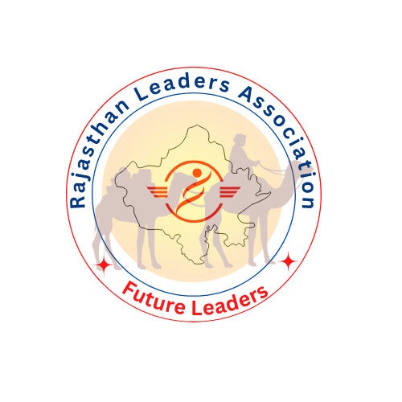

# Welcome to the Rajasthan Leaders Association (RLA)

**An Initiative from Academicians of DU & JNU** [cite: 1]

  __

## Winds for Change - Future Leaders [cite: 1]

The **Rajasthan Leaders Association (RLA)** is driven by a vision to improve society by developing the leadership potential of Rajasthani young minds[cite: 2, 35]. We are creating a sustainable platform for youth from Rajasthan to promote culture, social values, and knowledge for future leadership[cite: 3, 36].

**Our Philosophy: "Giving Back to Society"** [cite: 4, 37]

**Our Motto: "Together We Rise"** [cite: 6, 32, 39]

---

### What We Do

RLA actively engages with students, professionals, bureaucrats, and entrepreneurs to drive positive change within the local community[cite: 4, 37]. We focus on:

* **Networking & Empowerment** [cite: 10]
* **Awareness & Advocacy** [cite: 10]
* **Promotion & Capacity Building** [cite: 10]
* **Community Development** [cite: 10]

Over the past 10 years, RLA has impacted over 10,000 Rajasthani students, focusing on marginalized groups and engaging youth in nation-building[cite: 4, 37].

[**Learn More About Us**](./about.md) | [**Explore Our Initiatives**](./initiatives.md) | [**Get Involved**](./get-involved.md)

---

### Addressing the Needs of Youth

We recognize the challenges faced by young minds, including lack of career awareness and readiness for the workforce[cite: 22, 44, 46, 47, 48, 51]. RLA aims to empower youth to overcome these obstacles and realize their full potential[cite: 8, 52].

---

**Connect with Us:**

* [Facebook](https://www.facebook.com/rlaindia) [cite: 7, 26, 31]
* [Instagram](https://www.instagram.com/rla.india) [cite: 26]
